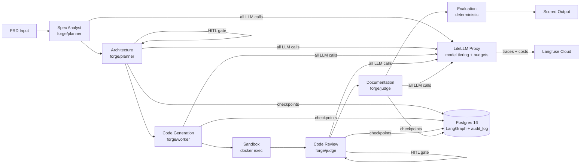

# ForgeFlow

**PRD-to-production multi-agent pipeline with governance, observability, and human-in-the-loop control.**

---

## What it does

ForgeFlow takes a Product Requirements Document and drives it through a supervised AI pipeline — spec analysis, architecture design, code generation, code review, documentation, and evaluation — with human approval gates at key decisions and full cost/trace observability throughout.

```
PRD → Spec Analyst → Architecture [HITL] → Code Generation → Code Review [HITL]
    → Documentation → Evaluation → scored output
```

Every LLM call routes through LiteLLM proxy (model tiering, budget caps, cost tracking).  
Every agent node writes an append-only audit entry to Postgres.  
Every trace is visible in Langfuse.

---

## Architecture



---

## Tech stack

| Layer | Technology | Version |
|-------|-----------|---------|
| Orchestration | LangGraph | 1.x |
| LLM gateway | LiteLLM proxy | latest |
| Observability | Langfuse | 3.x |
| State validation | Pydantic v2 | 2.7+ |
| API | FastAPI + sse-starlette | 0.115+ |
| Database | Postgres 16 + pgvector | 16 |
| Frontend | Next.js | 16 |
| Python | Python 3.12 via uv | 3.12 |

**Model tiering:**
- `forge/planner` → Claude Sonnet 4.6 (planning, spec, architecture)
- `forge/worker` → Groq llama3.3-70b (bulk code generation — cheap)
- `forge/judge` → Claude Haiku 4.5 (review, docs, eval scoring)

---

## Quickstart

```bash
# 1. Clone and setup
git clone https://github.com/revanthchristober/FlowForge
cd FlowForge
cp .env.example .env
# Edit .env: add ANTHROPIC_API_KEY, LANGFUSE keys

# 2. Start infrastructure (Postgres + LiteLLM)
make setup       # install uv, Python 3.12, sync deps
make up          # docker compose up

# 3. Start backend + frontend
make dev         # FastAPI on :8000
make dev-frontend  # Next.js on :3000

# Open http://localhost:3000
```

---

## Key features

**HITL gates** — Two interrupt points where a human reviews and approves/revises:
1. Architecture proposal (stack + modules + ADR)
2. Code review results (static analysis + LLM findings)

**Budget governance** — Per-run dollar cap ($5 default). Budget checked before every LLM call. Audit log records every cost.

**Append-only audit log** — Postgres rule prevents UPDATE/DELETE. Every agent write + every human decision is permanently recorded.

**Eval harness** — 4 deterministic scorers against golden PRDs. Run `make eval` to score, `make eval-baseline` to save baseline, `make eval-compare` to show regression after prompt changes.

**Model tiering story** — Planning agents use Sonnet (expensive, smart). Code generation uses Groq llama (10× cheaper). Review uses Haiku (balanced). All visible in the cost panel.

---

## Dashboard

The Next.js dashboard (`localhost:3000`) shows:
- **Runs list** — all runs, live status, cost summary
- **Timeline panel** — agent-by-agent progress with live SSE updates
- **Approval panel** — surface HITL gates, approve/revise from the browser
- **Cost panel** — per-agent and per-model spend vs cap
- **Eval panel** — 4-metric scorecard with rationales

---

## Development

```bash
make test              # run backend pytest (110+ tests)
make test-frontend     # run frontend vitest
make eval              # run golden PRD eval suite
make eval-baseline     # save current scores as baseline
make eval-compare      # compare against baseline (regression demo)
make sandbox-build     # build Docker sandbox image for code execution
make down              # stop Docker services
```

---

## Project structure

```
backend/forgeflow/
  agents/          # spec_analyst, architecture, code_generation, code_review, documentation, evaluation
  eval/            # 4 scorers + runner CLI
  graph.py         # LangGraph StateGraph wiring
  state.py         # ForgeState Pydantic model (single source of truth)
  api.py           # FastAPI app + SSE endpoints
  sandbox.py       # Docker exec wrapper for safe code execution

frontend/src/
  app/             # Next.js App Router pages
  components/      # timeline-panel, approval-panel, cost-panel, eval-panel
  lib/             # api.ts, types.ts, sse.ts (useSSE hook)

golden_prds/       # todo_api, auth_unsafe, invoice_parser, mini_crm + expected.yaml
infra/             # docker-compose.yml, litellm.config.yaml
```
